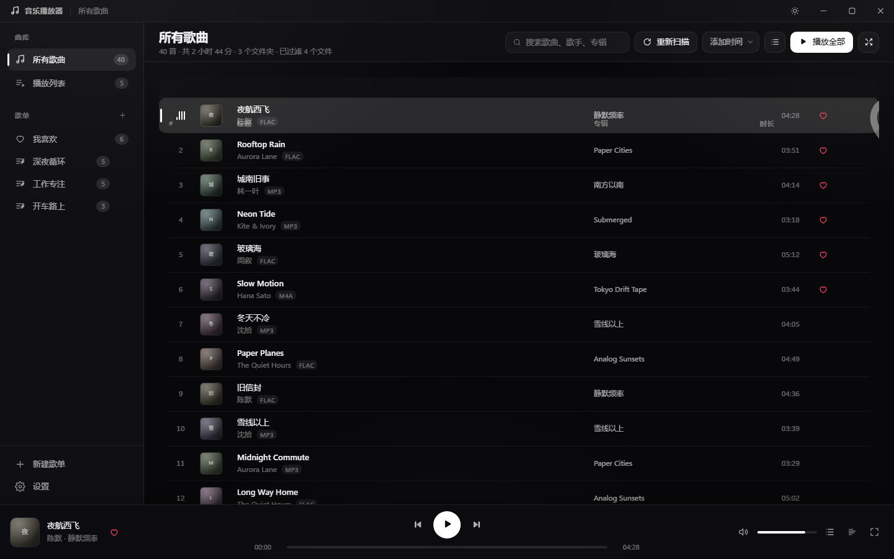
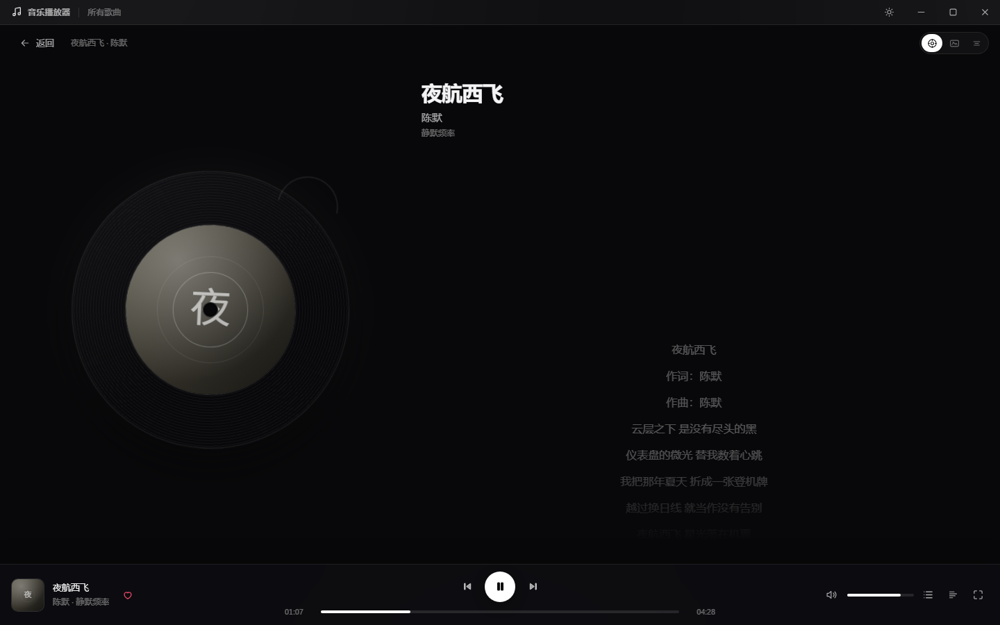
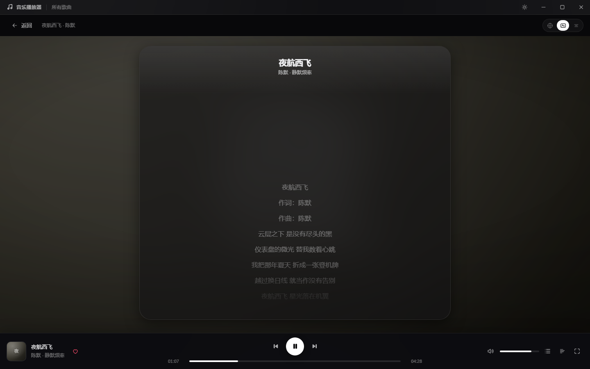
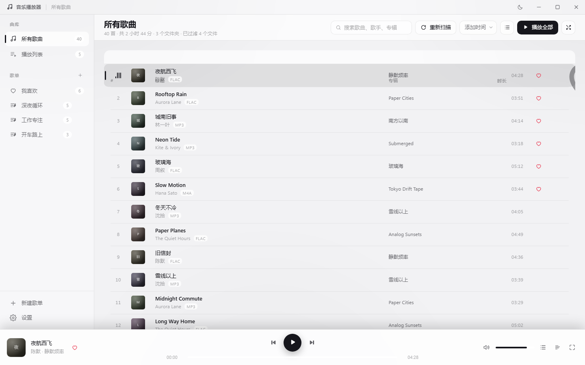
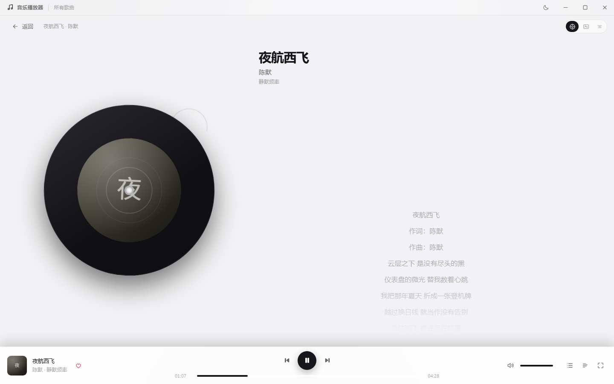
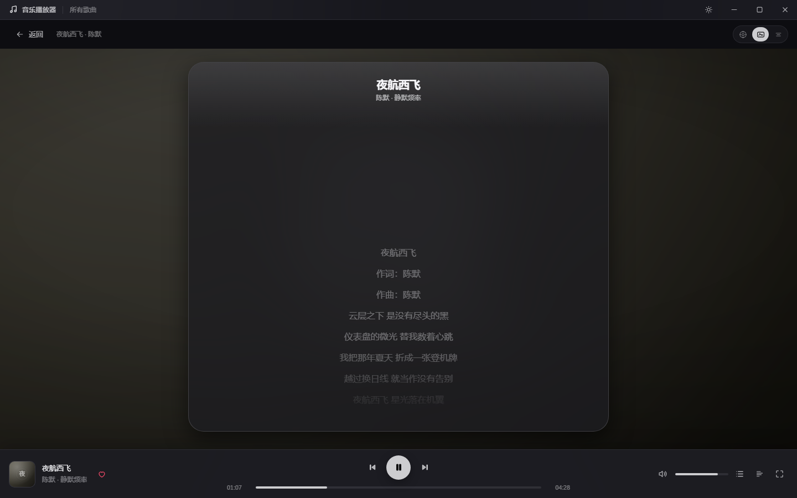
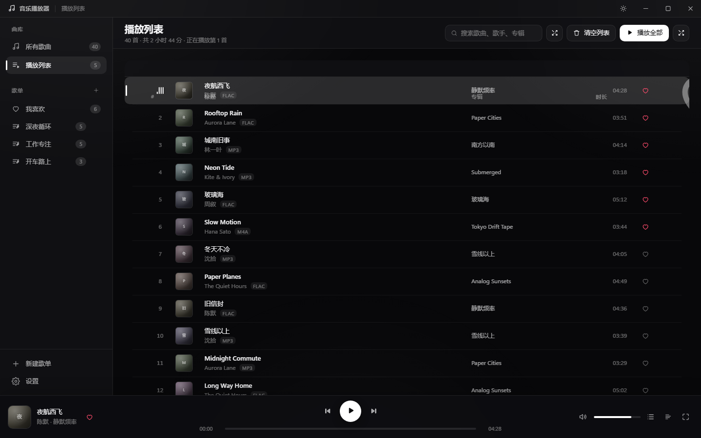
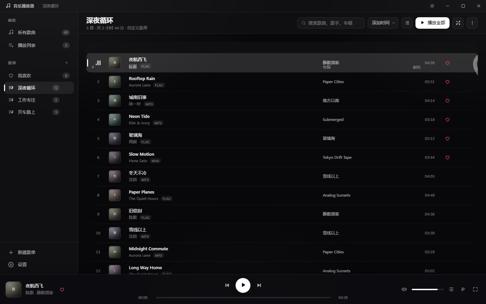
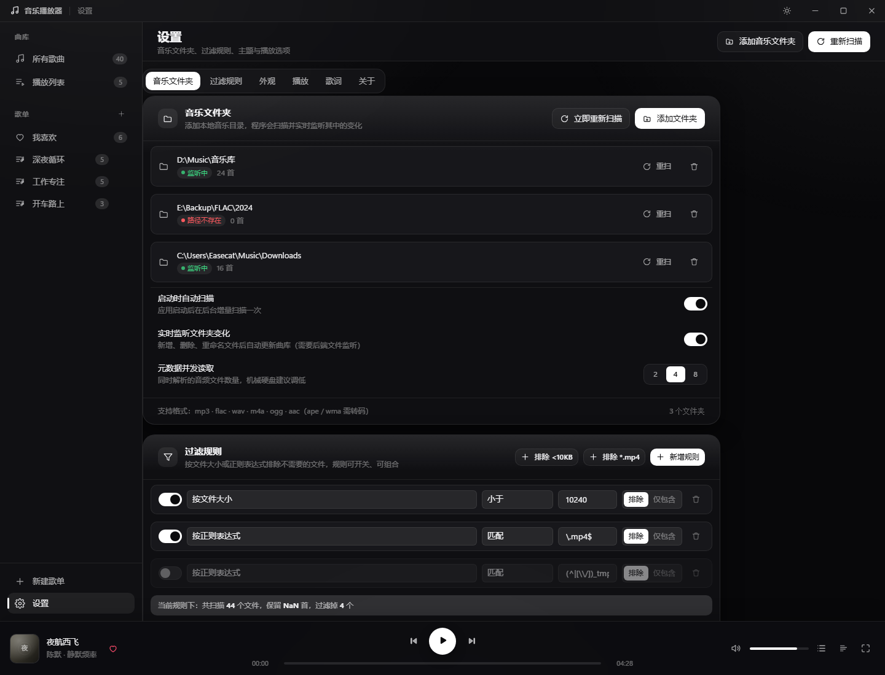

<div align="center">

# 本地音乐播放器 · localMusicPlayer

**本地曲库为主、在线试听为辅的 Windows 桌面音乐播放器**

Go · Wails v3 · Lit 3 · Vite · FFmpeg

[](LICENSE)
[](https://github.com/nihaozyj7/localMusicPlayer/releases)
[](#系统要求)
[](https://v3.wails.io/)

**简体中文** · [English](README.en.md)

[功能](#功能) · [截图](#截图) · [下载](#下载) · [开发](#开发) · [技术栈](#技术栈) · [开源与致谢](#开源与致谢)

</div>

---

## 这是什么

一个**只做本地音乐**的桌面播放器：把散落在硬盘上的音乐文件夹交给它，它会扫描、解析标签与封面、
监听文件变化，然后把界面做得像样一点。

它同时带一点在线能力（搜索、试听、下载、封面与歌词自动匹配），但**所有在线功能都是可选的**：
不联网时它就是一个完全离线的本地播放器，曲库、封面、歌词缓存全部在你自己机器的磁盘上。

### 三个「不需要」

- **不需要安装浏览器内核**：界面跑在 Windows 自带的 WebView2 上，不塞一整套 Chromium；
- **不需要预先装 FFmpeg**：程序内嵌一份自行编译的 5.6MB 精简版，用来放 `ape` / `wma` / `dsf`
  这些 WebView 放不了的格式；想换的话，用自己编译的 `ffmpeg.exe` 覆盖数据目录里那份即可；
- **不需要联网**：断网时曲库、歌词、封面、主题与播放样式照常工作 —— 在线功能没有一个藏在必经路径上。

### 功能地图

| 分区 | 里面有什么 |
| --- | --- |
| [曲库](#曲库) | 多文件夹实时监听、过滤规则、标签与多封面解析、稳定 ID |
| [播放](#播放) | 字节级精确 seek、内嵌 FFmpeg 转码缓存、响度均衡、跳过首尾静音、切歌间隔、三档音效、坏歌自动跳过 |
| [封面](#封面) | 一首歌多张封面、缓存与内嵌分开管理、五源联网匹配、原子写回文件 |
| [歌词](#歌词) | 四级回退、字级（逐字）歌词、歌词工作台、桌面悬浮歌词、桌面背景歌词 |
| [界面](#界面) | 三套主题 + 自定义 CSS、内置两款播放界面样式 + 可扩展的样式插件、排序 / 列 / 密度 / 动画帧率全可调 |
| [在线与 AI](#在线与-ai) | 搜索 → 试听 → 下载、试听即缓存、AI 元数据清洗与下载后整理（可选） |
| [更新](#更新) | 手动或启动时检查更新，多镜像通道下载，可跳过指定版本 |

---

## 功能

### 曲库

- **多文件夹 + 实时监听**：`fsnotify` 递归监听，新增 / 删除 / 重命名文件后自动增量重扫；
- **过滤规则**：按文件大小、按正则表达式（同时匹配路径与文件名）过滤，编辑时实时预览会滤掉多少；
- **元数据解析**：读取 mp3 / m4a / flac / ogg 的标签与**多张内嵌封面**；
- **稳定 ID**：同一路径永远得到同一个 id，重扫后歌单 / 收藏 / 队列不会失效。

### 播放

- 本地音频 HTTP 服务（`127.0.0.1` + token），原生格式支持字节级 `Range` 精确 seek；
- 内置 FFmpeg 转码，`ape` / `wma` / `dsf` 等格式转成 PCM/WAV 后播放，转码结果按文件缓存；
- **响度均衡**：EBU R128（`loudnorm`）测量 + 回放增益补偿，支持逐曲或同专辑统一；
- **跳过首尾静音**：可分别开启「跳过开头无声」与「跳过结尾无声」，自动掠过现场录音开头的空白与
  CD 抓轨拖在尾巴上的静音。歌曲长度、进度条与歌词仍按**原曲**呈现，只是那两段不会被播放；
  检测在解码后的 PCM 上做并按文件缓存，同一首歌第二次播放零开销；
- **切歌间隔**：自动切下一首时留出的停顿（默认 1.5 秒，可调 0~10 秒），计时跑在音频线程上，
  界面卡顿不会让它忽长忽短；
- **音效**：清澈人声 / 低音增强 / 3D 环绕（针对耳机调校的空间感；声像与早期反射会**随时间绕着头转**，
  不是静态加宽），在播放选项面板里一键切换，切档约 30ms 平滑过渡（不做任何处理即「关闭」）；
- **坏歌不卡住你**：播放失败会提示并自动跳到下一首，连续失败到阈值就熔断、不再反复死磕，
  只有你亲手点播才会再试；
- **播放选项面板**（底栏「选项」）：歌词字号、桌面歌词模式、音效档位、播放界面背景不透明度；
- 播放队列拖拽排序、歌单、我喜欢、定时停止、可自定义的快捷键；
- 无边框窗口 + 系统绘制的圆角 + 最小化到托盘。

### 封面

- 一首歌可以有多张封面：缓存里的（可增删 / 切换 / 轮播）与文件内嵌的（只读展示）分开管理；
- 联网匹配聚合 iTunes / 网易云音乐 / QQ 音乐 / Deezer / MusicBrainz 五个来源；
- 匹配结果可以一次性写回歌曲文件（m4a 的多个 `covr`、flac 的多个 `PICTURE`），写盘走「临时文件 + 原子改名」。

### 歌词

- 四级回退：文件内嵌 → 同目录 `.lrc` → 程序缓存 → 在线自动匹配（LRCLIB / 网易云 / QQ 音乐）；
- **字级（逐字）歌词**：认增强 LRC / QRC / KRC / 网易云 klyric·YRC 五种写法并统一成增强 LRC，
  **同一批歌词里字级优先于行级**，详情页按字点亮（只有写进歌曲文件时才剥成行级，
  免得别的播放器把 `<00:12.000>` 当成正文）；歌词工作台的来源徽标会标「逐字」；
- **歌词工作台**：在线匹配 / 整首微调（±10s）/ 手动打轴（一边播放一边按空格）；
- **桌面歌词**：独立的透明置顶窗口，鼠标移入才变成「正常窗口」并浮出样式下拉，位置会被记住；
- **桌面背景歌词**：铺满桌面、垫在桌面图标之下。
  两者互斥，所以在底栏「选项」面板里合成一组三选一：**桌面歌词 [关闭 | 悬浮 | 背景]**。

### 界面

- **主题**：内置深色极简 / 浅色极简 / 封面取色，支持放一份 CSS 自定义主题；
- **播放界面样式插件**：内置**经典 / 沉浸**两款，第三方样式包放进数据目录即可加载，
  与内置走**同一条**加载路径（清单 `skin.json` + 入口 `skin.js` + 样式 `skin.css` 自包含）；
  接口契约见 [`packages/player-skins`](frontend/packages/player-skins)，
  写法与排错见示例包自带的《皮肤说明.md》；
  - **隔离**：插件 CSS 被宿主强制包进 `@layer skin` + `@scope(舞台)` —— 插件碰不到
    标题栏 / 底栏 / 播放队列，也污染不到别的界面；
  - **配色**：插件在清单里声明 `colors.bg/fg`（或 `colors.theme`），宿主据此把**自己**
    的控件栏配色派生好并做对比度兜底；缺声明就在设置页的样式卡片上亮警告图标、
    降级用主题配色；
  - （2026-10 移除的简约 / 二次元手绘 / 魔法阵 · 手绘次元 / 星阵咏唱四款样式
    已完整备份，可当第三方样式再加回来 —— 写法见 [`docs/42-播放器样式插件系统设计方案.md`](docs/42-播放器样式插件系统设计方案.md)
    与 `internal/skins/template/` 里的《皮肤说明.md》）
- **排序**：工具栏一个按钮打开悬浮面板，字段（添加时间 / 标题 / 歌手 / 专辑 / 时长 / 文件大小 /
  播放次数）与方向（升序 / 降序）分开选，按钮上直接显示当前排序；点表头也能直接切换；
- 列表密度、列显示、动画速度都可以调；关闭动画时全部动效统一归零；
  播放界面背景动效另有**帧率档位**：流畅（跟随刷新率）/ 性能优先（限帧、暂停即定格，更省电）。

### 在线与 AI

- 在线搜索 → 试听 → 下载到本地（下载目录可配置、可迁移，下载完自动入库）；
- **试听即缓存**：试听时音频会同步落到本地缓存，于是「播放列表里那首在线歌」和本地歌一样
  可以被后端解码播放；再点下载时直接从缓存搬到下载目录，不重复消耗流量；
- **AI 元数据清洗**（可选）：填一个 OpenAI 兼容接口，自动匹配前先用 AI 从脏文件名里还原标题 / 歌手；
- **下载后 AI 整理**（可选，默认开启）：下载完成（直接下载或从试听缓存搬运）后在后台用 AI
  还原真实的标题 / 歌手 / 专辑并写回歌曲文件，支持 m4a / flac，其它格式只更新曲库。

### 更新

- 「设置 → 关于」里可以**手动检查更新**，也可以打开**启动时自动检查**（只在发现新版本时提示，
  检查失败不打扰）；
- 下载走 **GitHub Releases**，并提供多条**镜像通道**自动切换，网络受限时不必手动找安装包；
- 支持**跳过某个版本**，也能在设置里随时改主意。

---

## 截图

| 主界面 · 深色 | 播放界面 · 经典 | 播放界面 · 沉浸 |
| --- | --- | --- |
|  |  |  |

| 主界面 · 浅色 | 播放界面 · 浅色 | 封面取色主题 |
| --- | --- | --- |
|  |  |  |

| 播放队列 | 歌单 | 设置 · 音乐文件夹 |
| --- | --- | --- |
|  |  |  |

更多（窄窗口布局、浅色播放界面、多封面面板 ……）在 [`docs/screenshots`](docs/screenshots)。

---

## 下载

到 [Releases](https://github.com/nihaozyj7/localMusicPlayer/releases) 下载最新的 `lmplayer.exe`，
双击即可运行，**不需要安装**（绿色版）。软件内的「设置 → 关于 → 检查更新」也会指向同一个地方。

首次运行时程序会在数据目录解包内嵌的 FFmpeg：

```text
%APPDATA%\LocalMusicPlayer\         配置、曲库缓存、歌词与封面缓存
%LOCALAPPDATA%\LocalMusicPlayer\bin\  解包出来的 ffmpeg.exe（可以直接替换）
```

在线试听的音频缓存放在系统临时目录（`%TEMP%\LocalMusicPlayer\online\`），
**不会**进下载目录、也不进曲库扫描 —— 它只是一份可丢弃的派生数据，
系统清理掉之后下次试听会自动重新下载。

### 系统要求

- Windows 10 1809+ / Windows 11（x64）
- [WebView2 运行时](https://developer.microsoft.com/microsoft-edge/webview2/) —— Windows 11 与较新的
  Windows 10 已预装；没有的话装一次 Evergreen Runtime 即可

> 目前只在 Windows 上验证过。代码里保留了 macOS / Linux 的分支（数据目录、托盘等），
> 但没有实际验证与 CI 覆盖，欢迎补充。

---

## 开发

### 需要什么

| 依赖 | 版本 | 说明 |
| --- | --- | --- |
| [Go](https://go.dev/) | 1.25+ | 后端 |
| [Node.js](https://nodejs.org/) | ≥ 20.19 | 前端构建与检查 |
| [Wails v3 CLI](https://v3.wails.io/) | `v3.0.0-beta.14` | `go install github.com/wailsapp/wails/v3/cmd/wails3@latest` |
| [WebView2](https://developer.microsoft.com/microsoft-edge/webview2/) | — | 运行应用时用 |
| MinGW-w64 | — | **只有**要重新编译内置 FFmpeg 时才需要 |

### 只改界面（不需要 Go）

```powershell
npm install
npm run dev        # Vite 开发服务器（HMR），默认 http://127.0.0.1:5173/
```

浏览器预览用假数据渲染，改 CSS / JS 后刷新即可。`npm run dev:static` 是不依赖 `node_modules` 的
静态预览（自检脚本用这个）。

### 跑起来

```powershell
npm install
wails3 task run    # 构建前端 → 生成绑定 → go build → 直接运行
```

### 打包

```powershell
wails3 task build     # 只出 exe，产物在 bin/
wails3 task package   # 出 Windows 安装包（NSIS）
```

### 检查

```powershell
npm run check              # ESLint + tsc 类型检查 + node:test 单测
wails3 task test           # Go 单元测试
wails3 task check:go       # gofmt + go vet + go test -race
wails3 task ffmpeg:info    # 查看内嵌 ffmpeg 的体积 / 许可证 / 能力清单
```

`tools/` 下还有一批无头浏览器自检脚本（CDP 驱动 Edge），用来验证真实交互而不是「元素存在」：

```powershell
node tools/dev-server.js 5173   # 另开一个终端起着
node tools/cdp-check.js         # 14 个场景的布局与 console 报错检查
node tools/hitcheck.mjs         # 用真实鼠标坐标做命中测试（能抓到「弹层透明但吃了点击」这类 bug）
```

完整的工具清单与开发约定见 [`docs/19-开发说明.md`](docs/19-开发说明.md)。

---

## 技术栈

| 层级 | 用了什么 |
| --- | --- |
| 后端 | Go 1.25 —— 目录扫描、标签解析、音频 HTTP 服务、响度测量、在线接口聚合 |
| 桌面外壳 | Wails v3（Go ↔ WebView 桥、无边框窗口、托盘、单实例、系统文件对话框） |
| 渲染引擎 | WebView2（系统自带，不内嵌浏览器内核） |
| 前端视图层 | Lit 3（自定义元素，light DOM；只负责模板与增量 diff，样式仍是全局 CSS） |
| 前端工程 | 原生 ES Module + Vite 7 + npm workspaces + ESLint / Prettier / TypeScript(JSDoc) |
| 音频 | 内嵌自编译 FFmpeg 8.1.2（LGPL-2.1+）+ 自实现的 EBU R128 响度补偿 |

### 目录结构

```text
main.go                  应用入口：装配配置 / 主题 / 曲库 / 音频服务 / 窗口 / 托盘
services*.go             Go 侧服务（绑定给前端的接口）
internal/
  bootstrap/             数据模型、配置读写、稳定 id、扫描根计算
  library/               扫描、元数据缓存、增量重扫、fsnotify 监听
  meta/  lyrics/         标签、封面、歌词解析
  media/                 本地音频 HTTP 服务（CORS / Range / 转码缓存）
  audioplay/             DSP：响度补偿、音效、绕头轨道运动
  onlinecache/           在线试听的音频缓存（临时目录、原子落盘、下载时搬走）
  loudness/              EBU R128 响度测量与补偿增益
  update/                检查更新与镜像通道下载
  ffmpeg/                内嵌 ffmpeg 的定位与解包（bin/ 不入库）
  coverfetch/ lyricsfetch/ bilibili/   三个随时会变的第三方接口，各自独立成包
  metacache/ skins/ theme/             多封面缓存写回、样式包、主题目录
frontend/
  src/                   页面（Lit 组件 + 全局 CSS，无 JSX / 无 TS 源码）
  packages/player-skins/ 播放界面样式包（第三方可扩展的契约在这里）
  bindings/              wails3 生成的 Go 绑定（可重新生成）
  dist/                  Vite 产物，被 go:embed 打进 exe
build/                   Wails 打包脚手架与精简 ffmpeg 的编译脚本
tools/                   构建脚本 + 无头浏览器自检脚本
docs/                    设计、审查与实现文档
```

### 几条刻意的取舍

- **源码是原生 JS**：打包器只负责依赖解析与产物哈希，不引入 JSX / TS。需要类型的地方用 JSDoc，
  `tsc --checkJs` 吃得到，保持「打开文件就能读」。
- **样式是全局 class，不是 Shadow DOM**：主题 CSS、样式包、自检脚本都按 `#id` / `.class` 查询，
  它们**是对外契约**。Lit 在这里只负责模板与增量更新。
- **依赖第三方网络的代码各自独立成包**：`internal/bilibili` / `lyricsfetch` / `coverfetch` 接口随时会变，
  隔离之后失效范围只有一个文件。
- **写用户文件的代码只做最小插入**：往 m4a / flac 里加封面时不改动音频数据、不改动任何 chunk 的
  语义与顺序；但容器头部变大后，记录数据块绝对位置的偏移（`stco` / `co64`）**必须按 delta 同步** ——
  不同步就是把文件写坏。判据是「能不能证明它安全」：遇到无法同步的容器结构，
  宁可**放弃写入并保持原文件一字节不动**，也不赌一把。写盘一律「临时文件 + 原子改名」。

---

## 开源与致谢

### 许可证

本项目以 **Apache License 2.0** 开源，全文见 [`LICENSE`](LICENSE)。

```text
Copyright 2026 The localMusicPlayer Authors

Licensed under the Apache License, Version 2.0 (the "License");
you may not use this file except in compliance with the License.
You may obtain a copy of the License at

    http://www.apache.org/licenses/LICENSE-2.0
```

你可以自由使用、修改、分发（包括商用），需要保留版权与许可声明，并说明你改了什么。

### 第三方组件

程序里分发了一部分第三方代码与二进制，它们的许可证与版权声明见：

- [`THIRD-PARTY-NOTICES.md`](THIRD-PARTY-NOTICES.md) —— 全部依赖、版本、许可证与版权行；
- [`NOTICE`](NOTICE) —— Apache-2.0 要求的声明文件；
- [`internal/ffmpeg/bin/FFMPEG-LICENSE.txt`](internal/ffmpeg/bin/FFMPEG-LICENSE.txt) —— 内嵌 FFmpeg 的来源、
  编译选项与 LGPL 结论。

界面里的「设置 → 关于」会把同一份清单直接展示出来（数据源在 `frontend/src/js/about-info.js`）。

### 数据来源

在线能力调用了下面这些公开服务，版权归各自权利人所有，本项目与它们没有隶属或背书关系：

[LRCLIB](https://lrclib.net/) · [网易云音乐](https://music.163.com/) · [QQ 音乐](https://y.qq.com/) ·
[iTunes Search API](https://performance-partners.apple.com/search-api) · [Deezer](https://developers.deezer.com/api) ·
[MusicBrainz](https://musicbrainz.org/) · [哔哩哔哩](https://www.bilibili.com/)

### 致谢

感谢 [Go](https://go.dev/)、[Wails](https://v3.wails.io/)、[Lit](https://lit.dev/)、[Vite](https://vite.dev/)、
[FFmpeg](https://ffmpeg.org/) 以及 [`THIRD-PARTY-NOTICES.md`](THIRD-PARTY-NOTICES.md) 里列出的每一个库 ——
没有它们，这个播放器不会存在。

也感谢上面那些数据服务的提供方，以及每一位提反馈的人：界面细节、格式兼容性、性能问题的每一条
都直接变成了代码里的修复。

### 免责声明

- 本软件只做**本地音乐的整理与播放**，不提供、不存储、不分发任何音乐内容；
- 在线搜索 / 试听 / 下载依赖第三方公开接口，可用性与内容由对应平台决定；
- 自动匹配的封面与歌词来自公开曲库，**不保证与歌曲完全对应**，请自行核对后再写回文件。

---

<div align="center">

如果这个项目对你有用，欢迎 Star ⭐ 或提 Issue。

</div>
